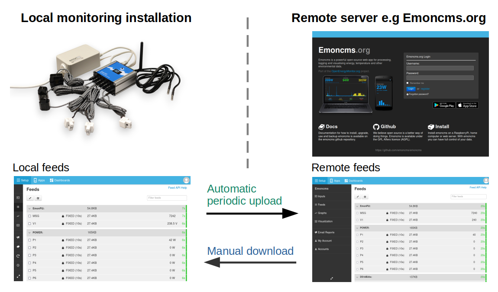
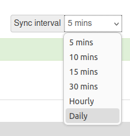
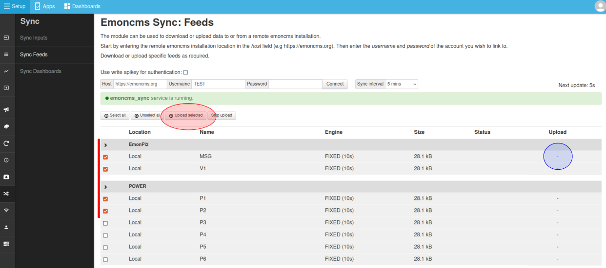
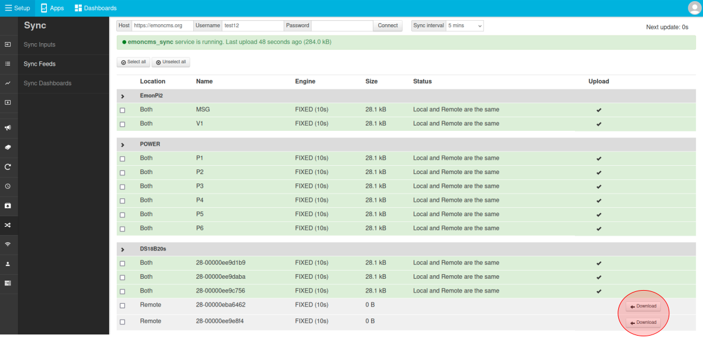

# Emoncms Sync Module

The Emoncms sync module provides a convenient way to synchronise (upload or download) timeseries feed data between two instances of Emoncms. This will typically be a emonPi or emonBase in the home or building being monitored and a remote server such as [emoncms.org](https://emoncms.org):

## Automatic periodic upload

**Background and overview:** Historically a piece of software called emonHub has been the default way to post input data to both the local emoncms installation running on an emonPi/base and to a remote server such as emoncms.org. The disadvantage of this approach has been the need to configure input processing twice for applications that require both local and remote logging. **The sync module can be used instead of the *emonHub Emoncms HTTP interfacer*** that posts data to the remote server. Input processing only needs to be configured once on the local emonPi/base as it's the resulting feed data that gets uploaded and replicated to the remote server.

The sync module automatic upload mechanism is **both bandwidth efficient** with data uploaded in binary format and also **resilient to internet connection outages**. In the event of an internet outage, feed data will still be recorded locally on the emonPi/base and the sync module will retry uploading new feed data until successful.

## Manual download

The sync module also provides a way download feed data from a remote server onto the local emoncms instance. This can be useful for recovery in the event of SD card failure, backing up data on a remote server, or for applications where it makes sense to move from recording data remotely to local only. Data download is a one time manual process rather than an automated periodic sync.

## Using the Sync module
Login to your local installation of emoncms. **Navigate to Setup > Sync.**

### Authentication

It's possible to link your local emoncms instance with the remote server with either **username and password login** or a **write apikey**. The default remote server is **emoncms.org** change this as required if you are using a different remote server. Enter the relevant credentials and then click Connect. 

**HTTPS vs HTTP:** While HTTPS provides clear security benefits with both secure authentication and encryption, it does add a significant bandwidth overhead. If you have a bandwidth constrained application where security is of lower concern consider using HTTP instead. Bandwidth can also be reduced significantly by choosing a longer upload interval e.g hourly or daily.

**Login authentication:**

**Write apikey authentication:**

### Upload interval

The default upload interval is every 5 minutes. If you have a bandwidth constrained application consider using a longer upload interval.

### Select feeds to upload

Feeds to upload can either be selected by selecting each feed via the checkbox field on the left and then clicking on **Upload selected** - or - clicking on the Upload column for each feed (blue circle) which will toggle the upload status directly.

Once selected feeds will upload within a few seconds. If the remote feed is up to date with the local feed the feeds will be highlighted in green and status will note: "Local and Remote are the same":

These feeds will now continue to be synchronised at the selected sync interval.

### Downloading feeds

If a feed only exists on the remote server or if the remote server is ahead of the local server a **Download** button will appear next to these feeds. Click on each feed to download. Unlike the sync upload option above downloaded feeds will not automatically download new data available on the remote server, this is a manual download option.

---

## Update

### EmonPi, Emonbase Update

The Sync module is included in the default EmonPi/EmonBase software stack. It can be updated by navigating to Admin > Update and clicking on Full Update. Alternatively to selectively update this module, navigate to Admin > Components and update both Emoncms Core and the Sync module on this page.

### Command line update

To update via command line:

1\. Update Emoncms core:

    cd /var/www/emoncms
    git pull

2\. Update the sync module:

    cd /opt/emoncms/modules/sync
    git pull
    ./install.sh

## Install

**Note:** The sync module has hard coded paths for the emoncms directory location that point to: /var/www/emoncms.

Install the sync module to /opt/emoncms/modules (you may need to create those directories first):

    cd /opt/emoncms/modules
    git clone https://github.com/emoncms/sync.git
    
Run the installation script:

    cd /opt/emoncms/modules/sync 
    ./install.sh
    
### Install Service Runner

The sync module downloads data via a background process called by the service-runner service. Service runner is installed as standard on the emonPi/emonBase emonSD software stack. For manual installation please see: [Emoncms: Service-runner installation details here](https://github.com/emoncms/emoncms/blob/master/scripts/services/install-service-runner-update.md).

### Backup utility

You may also be interested in the python based emoncms backup utility if you do not wish to setup a local emoncms instance to download/backup/archive emoncms data from a remote server such as emoncms.org: https://github.com/emoncms/usefulscripts/tree/master/backup_py
